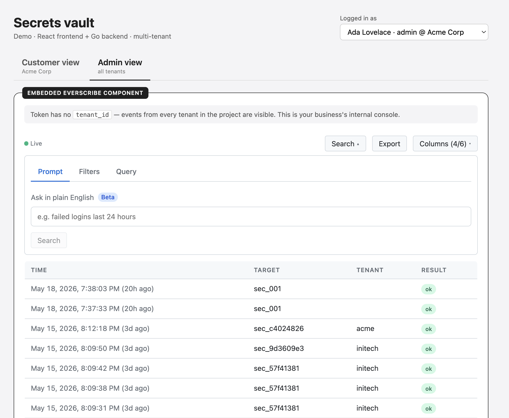

  

<h1 align="center">Everscribe components</h1>

  
  &nbsp;&nbsp;&nbsp;&nbsp;
  
  &nbsp;&nbsp;&nbsp;&nbsp;
  
  &nbsp;&nbsp;&nbsp;&nbsp;
  
  &nbsp;&nbsp;&nbsp;&nbsp;
  

  

  Open source embeddable audit-trail UI for <a href="https://everscribe.io">Everscribe</a>. 
  Drop a branded, live activity log into your single or multi-tenant product.

  Screenshot from the <a href="https://github.com/everscribe/examples">full-stack runnable examples</a>.

  

## 📖 Documentation

Start with the [prerequisites](https://everscribe.io/docs/web-components/prerequisites)
for the embed flow, token minting, refresh, and secret rotation. Per-package reference:

| Package | Documentation |
|---|---|
| [`@everscribe/components-react`](packages/react#readme) | [React](https://everscribe.io/docs/web-components/react) |
| [`@everscribe/components-element`](packages/element#readme) | [Web component](https://everscribe.io/docs/web-components/vanilla) |
| [`@everscribe/components-core`](packages/core#readme) | [Core](https://everscribe.io/docs/web-components/core) |
| [`@everscribe/components-styles`](packages/styles#readme) | [Styles](https://everscribe.io/docs/web-components/styles) |

> **Vue, Angular, and Svelte** (shown above) are covered by [`@everscribe/components-core`](packages/core#readme), the framework-agnostic data layer whose observable stores plug into any framework's reactivity, so you can build the audit-trail UI in whatever stack you use. The `<audit-trail>` [Web component](packages/element#readme) is a drop-in alternative that works in all three as well.

